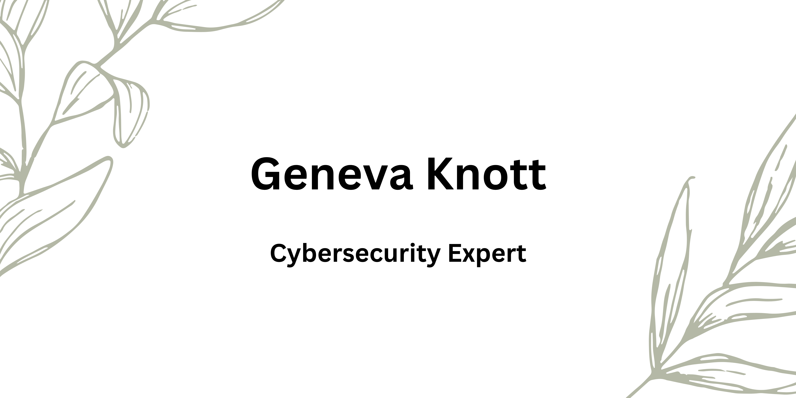

&nbsp;&nbsp;

### Projects
 
 

#
#### Cybersecurity professional with a strong background in investigative law and experience in radio communications installation, configurations, and maintenance. Proficient in network security, vulnerability scanning, and incident response. Skilled in basic programming and scripting languages. Strong communication and collaboration abilities with a commitment to continuous learning. Proven track record of developing case plans, conducting comprehensive investigations, and managing information security tools and databases. Detail-oriented, problem-solving and critical-thinking skills. Self motivated seeking new challenges. 
# 
### 💎 Skills
- Technical skills: Network security, vulnerability scanning and assessments, penetration testing, intrusion detection and prevention, incident response, and malware analysis.
= Risk Assessment: Ability to identify, assess, and mitigate potential risks and vulnerabilities to an organization's systems and network.
- Programming and scripting: Familiarity with programming languages such as Python, PowerShell, and Bash.
- Communication and collaboration: Ability to communicate complex technical information to non-technical stakeholders and collaborate effectively with cross-functional teams.
- Continuous learning:A commitment to continuous learning and staying up-to-date with the latest cybersecurity trends and best practices.

#

### 🔥Certifcations:
- ITF+
- ISC2 Candidate 
#### Certifcation Goals:
- Net+
- Sec+

### ✅ Technologies and Tools
| Technologies  | & | Tools |
| ------------- |-------------| -----|
| GitHub | VS Code | Visual Studio | 
| VirtualBox | VPNs | WireShark |
| Packet Tracer | Kali Linux | Splunk |
| Nmap | Metasploit | 
#
### <h3>💡Education:</h3>
- Code Fellows, WA
    
    Ops and Cybersecurity Jan2023 - Jun2023
- Wayland Baptist University-San Antonio, Texas
  
   Bachelor's of  Applied Science-Criminal Justice

- NorthEast Vista College-San Antonino, Texas
  
  Associate's Degree- Cyber Defense-in progress

### <h3>🎉 Fun Facts</h3>
- I have a bengal kitty name Haku
- I love studio ghibili flims
- I was in robotics in highschool
